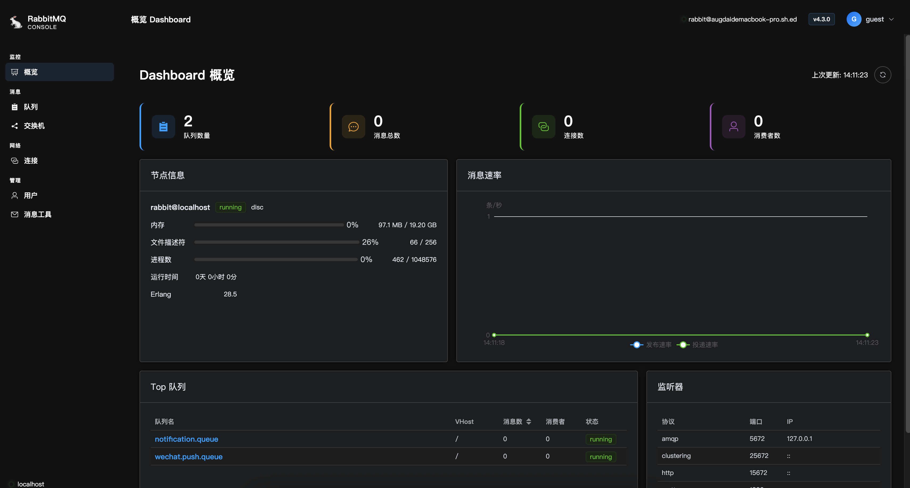
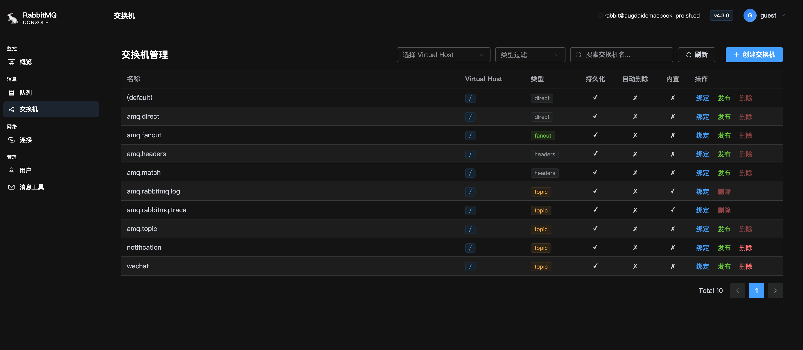

# RabbitMQ 在线管理面板（Vue 3 版）

## Project preview




## Repo

一款轻量、现代化的 RabbitMQ 可视化运维工具，基于 **Vue 3** + **Element Plus** 构建，通过 RabbitMQ 原生 HTTP API 实现无缝交互，无需安装任何插件即可完成消息队列的日常管理与监控。

## ✨ 核心功能

- **概览看板**：实时展示集群状态、节点信息、连接数、通道数及消息速率。
- **Exchange / Queue 管理**：支持增删改查、绑定关系配置、消息发布与消费模拟。
- **消息追踪**：提供消息 TTL、死信队列、延迟队列等高级特性配置界面。
- **用户与权限**：可视化管理虚拟主机、用户角色及权限策略。
- **监控告警**（可选）：结合 WebSocket 或轮询策略，自动刷新队列堆积、消费速率等关键指标。

## 🛠 技术亮点

- **Vue 3 Composition API**：逻辑复用清晰，性能更优。
- **TypeScript**（如采用）：类型安全，提升代码可维护性。
- **Axios 请求封装**：统一错误处理，支持 RabbitMQ 的 Basic Auth 或 OAuth2。
- **响应式布局**：适配 PC / 大屏，操作体验流畅。
- **轻量化部署**：纯前端静态资源，搭配 Nginx 代理即可快速接入现有 RabbitMQ 服务。

## 🎯 适用场景

- 开发 / 测试环境的快速调试
- 运维团队的集中队列巡检
- 需要简化 RabbitMQ 管理插件（默认 15672）操作流程的团队

## 🚀 快速体验

```bash
git clone https://github.com/augustdai/Web-RabbitMQ-vue3.git
yarn install
yarn dev